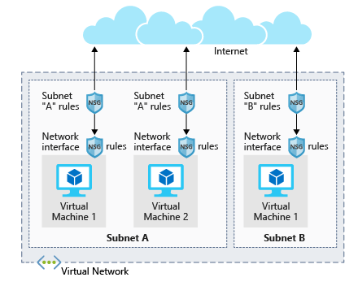

# Microsoft

Stores the generated keys in Azure in your private storage account.

Creating a KeyPair

1. Copy this command into Cloud Shell:

```Bash
ssh-keygen -t rsa -b 4096
```

2. Select the Enter key to accept the default location. The command creates two files: `id_rsa` and `id_rsa.pub` in the `~/.ssh` directory. The files are overwritten if they exist.

3. Enter a passphrase that you'll remember. You'll need this passphrase when you use the SSH key to access the VM.

When you add a passphrase to your SSH key, it encrypts the private key using 128-bit AES so that the private key is useless without the passphrase to decrypt it.

You can view the contents of the file in Azure Cloud Shell with the following command:

```Bash
cat ~/.ssh/id_rsa.pub
```

If you have already created a VM, you can install the public key onto your Linux VM with the ssh-copy-id command. Once the key has been authorized for SSH, it grants access to the server without a password, though you will still be prompted for the passphrase on the key if you set one.

For example, if we had a Linux VM named myserver with a user azureuser, we could use the following command to install the public key file and authorize the user with the key:

```Bash
ssh-copy-id -i ~/.ssh/id_rsa.pub azureuser@myserver
```

SSH key: AAAAB3NzaC1yc2EAAAADAQABAAACAQDBcmGZLo8s5zcg9iNTX41huAnSXDdvrNLqORE0VoopQEwT5XDKQKSPRfhDJebmHdTNFtYuC8EwLj1gZIByk6U+7CDoylLN2l2o5Vt7nBquOujm/R2UCsIrpaUpkQlN5C7+Nt+EAzIBxzD8jg2RqM/rmiPo8ekzOerIBdGsBGCtgUDsIMnK61mynMBIPlLs+WzQeZdNht+aZZ3MHq35WEjMFko4FWxBZT3dljb419VU2j5YbCtBAFPOewaMduI9k5ijeEjyDqwsElNmjKlYCt0VemYWP/++BqUJjKl1+TXWAYOMaUAf3qSTJSdhMJ7iKbQ+NAlOIexjCmr0mh5xkLYEDFlSbMZn5y0HnVzOS4qHuGXKS8U4efaeEFX0wKU5VUYuZ8X0c3jkCWgUkJVaA0IK7Ypj6D7wlds+VzyBQOkgPekfKqba3wZhBJaMRq/6+NX+fU/OU1WazoQsFWMGqYeohI/wo3mrDr0tut25jDPL2vJSV4wszu5YiKU6hChGNknMvw59mS2rwW8fvtt/N9QRnRBfREznup/WRgn6/LK+48Xhr0Xs+mB9LqkvHNzc06Ee4SGzecTqOKXC8LvjTuFeCAR1YM/ntVE3VwbIiNtCYrxBgduoZhNJP1yvS3EBZfKieFZTSDgFO8CcXCnICVFOdST1tCKZDFn0cpBVZnmP1Q== azureuser@cc-b263c6d1-8588b7f7f5-hd4d8

<https://docs.microsoft.com/en-us/learn/modules/create-linux-virtual-machine-in-azure/6-exercise-connect-to-a-linux-vm-using-ssh>
<https://docs.microsoft.com/en-us/learn/modules/create-linux-virtual-machine-in-azure/7-manage-vm>

## What is a network security group

Virtual networks (VNets) are the foundation of the Azure networking model and provide isolation and protection. Network security groups (NSGs) are the primary tool you use to enforce and control network traffic rules at the networking level. NSGs are an optional security layer that provides a software firewall by filtering inbound and outbound traffic on the VNet.

Security groups can be associated to a network interface (for per host rules), a subnet in the virtual network (to apply to multiple resources), or both levels.

### Security group rules

NSGs use rules to allow or deny traffic moving through the network. Each rule identifies the source and destination address (or range), protocol, port (or range), direction (inbound or outbound), a numeric priority, and whether to allow or deny the traffic that matches the rule.

An illustration showing the architecture of network security groups in two different subnets. In one subnet, there are two virtual machines, each with their own network interface rules.  The subnet itself has a set of rules that applies to both the virtual machines.



Each security group has a set of default security rules to apply the default network rules described above. **These default rules cannot be modified but can be overridden.**

### How Azure uses network rules

For inbound traffic, Azure processes the security group associated to the subnet and then the security group applied to the network interface. Outbound traffic is handled in the opposite order (the network interface first, followed by the subnet).

The rules are evaluated in priority order, **starting with the lowest priority rule**. Deny rules always stop the evaluation. For example, if a network interface rule blocks an outbound request, any rules applied to the subnet will not be checked. For traffic to be allowed through the security group, it must pass through all applied groups.

The last rule is always a Deny All rule. This is a default rule added to every security group for both inbound and outbound traffic with a priority of 65500. That means to have traffic pass through the security group, you must have an allow rule, or the final default rule will block it.

---------------------------

To create a VM you'll need:

- A virtual machine that provides CPU and memory resources.
- An Azure Storage account to hold the virtual hard disks.
- Virtual disks to hold the OS, applications, and data.
- Virtual network (VNet) to connect the VM to other Azure services or your own on-premises hardware.
- A network interface to communicate with the VNet.
- A public IP address so you can access the VM. This is optional.

All within a resource group.

- Address space: the overall IPV4 space available to this network.
- Subnet range: the first subnet to subdivide the address space - it must fit within the defined address space. Once the VNet is created, you can add additional subnets.

Remote Desktop (RDP) provides remote connectivity to the UI of Windows-based computers. RDP enables you to sign in to a remote physical or virtual Windows computer and control that computer as if you were seated at the console. An RDP connection enables you to carry out the vast majority of operations that you can do from the console of a physical computer, with the exception of some power and hardware-related functions.

## CLI

|Sub-command |Description |
| ----------- | ----------- |
| create |Create a new virtual machine |
|deallocate |Deallocate a virtual machine |
|delete| Delete a virtual machine|
|list| List the created virtual machines in your subscription|
|open-port|Open a specific network port for inbound traffic|
|restart|Restart a virtual machine|
|show| Get the details for a virtual machine|
|start| Start a stopped virtual machine|
|stop| Stop a running virtual machine|
|update| Update a property of a virtual machine|

