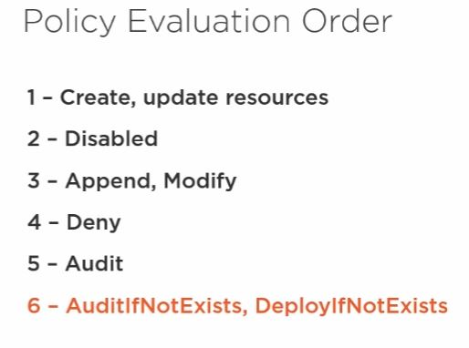

# Preguntas

1. cómo se hace la conexión de una VPN con Azure?

## Repasar

- Query search: <https://docs.microsoft.com/en-us/azure/azure-monitor/log-query/search-queries> <https://docs.microsoft.com/en-us/azure/azure-monitor/log-query/get-started-portal>
- RBAC: <https://docs.microsoft.com/en-us/azure/role-based-access-control/custom-roles> <https://docs.microsoft.com/en-us/azure/role-based-access-control/resource-provider-operations#microsoftresources>
- AZ AD: <https://docs.microsoft.com/en-us/azure/active-directory/fundamentals/active-directory-users-assign-role-azure-portal> <https://docs.microsoft.com/en-us/azure/active-directory/fundamentals/license-users-groups>
- Alerts: <https://docs.microsoft.com/en-us/azure/azure-monitor/platform/alerts-rate-limiting>
- DNS: <https://docs.microsoft.com/en-us/azure/dns/dns-import-export>
- Policies: <https://docs.microsoft.com/en-us/azure/governance/policy/concepts/definition-structure>
- BUR: <https://docs.microsoft.com/en-us/azure/backup/backup-azure-files> <https://docs.microsoft.com/en-us/azure/backup/backup-azure-vms-first-look-arm#defining-a-backup-policy> <https://blogs.microsoft.com/firehose/2015/02/16/february-update-to-azure-backup-includes-data-retention-up-to-99-years-offline-backup-and-more/> <https://docs.microsoft.com/en-us/azure/backup/backup-configure-vault>
- Storage Explorer: <https://docs.microsoft.com/en-us/azure/storage/common/storage-dotnet-shared-access-signature-part-1> <https://docs.microsoft.com/en-us/azure/vs-azure-tools-storage-manage-with-storage-explorer?tabs=windows>
- Storage account: <https://docs.microsoft.com/en-us/azure/storage/common/storage-account-options> <https://docs.microsoft.com/en-us/azure/storage/blobs/storage-quickstart-blobs-portal>
- File share: <https://docs.microsoft.com/en-us/azure/storage/files/storage-how-to-create-file-share>
- <https://docs.microsoft.com/en-us/azure/storage/common/storage-dotnet-shared-access-signature-part-1> <https://docs.microsoft.com/en-us/azure/vs-azure-tools-storage-manage-with-storage-explorer?tabs=windows>
- DataSet and DriveSet: <https://docs.microsoft.com/en-us/previous-versions/azure/storage/common/storage-import-export-tool-preparing-hard-drives-import?toc=%2Fazure%2Fstorage%2Ffiles%2Ftoc.json>
- More exam questions: <https://books.google.com.ar/books?id=fivbDwAAQBAJ&pg=PT40&lpg=PT40&dq=azure+%22file+explorer%22+vs+%22storage+explorer%22&source=bl&ots=1NXD3KbHiT&sig=ACfU3U3oy1uwWIpioUuTwnyfVY4iffE6BA&hl=es-419&sa=X&ved=2ahUKEwiF4uups5DqAhVXH7kGHYe8CAEQ6AEwEXoECAoQAQ#v=onepage&q=azure%20%22file%20explorer%22%20vs%20%22storage%20explorer%22&f=false>
- Storage Explorer: <https://docs.microsoft.com/en-us/azure/machine-learning/team-data-science-process/move-data-to-azure-blob-using-azure-storage-explorer>

| | Standard Load Balancer | Basic Load Balancer |
| --- | --- | --- |
| [Backend pool size](https://docs.microsoft.com/azure/azure-resource-manager/management/azure-subscription-service-limits#load-balancer) | Supports up to 1000 instances. | Supports up to 300 instances. |
| Backend pool endpoints | Any virtual machines or virtual machine scale sets in a single virtual network. | Virtual machines in a single availability set or virtual machine scale set. |
| [Health probes](./load-balancer-custom-probe-overview.md#types) | TCP, HTTP, HTTPS | TCP, HTTP |
| [Health probe down behavior](./load-balancer-custom-probe-overview.md#probedown) | TCP connections stay alive on an instance probe down __and__ on all probes down. | TCP connections stay alive on an instance probe down. All TCP connections terminate when all probes are down. |
| Availability Zones | Zone-redundant and zonal frontends for inbound and outbound traffic. | Not available |
| Diagnostics | [Azure Monitor multi-dimensional metrics](./load-balancer-standard-diagnostics.md) | [Azure Monitor logs](./load-balancer-monitor-log.md) |
| HA Ports | [Available for Internal Load Balancer](./load-balancer-ha-ports-overview.md) | Not available |
| Secure by default | Closed to inbound flows unless allowed by a network security group. Please note that internal traffic from the VNet to the internal load balancer is allowed. | Open by default. Network security group optional. |
| Outbound Rules | [Declarative outbound NAT configuration](./load-balancer-outbound-rules-overview.md) | Not available |
| TCP Reset on Idle | [Available on any rule](./load-balancer-tcp-reset.md) | Not available |
| [Multiple front ends](./load-balancer-multivip-overview.md) | Inbound and [outbound](./load-balancer-outbound-connections.md) | Inbound only |
| Management Operations | Most operations < 30 seconds | 60-90+ seconds typical |
| SLA | [99.99%](https://azure.microsoft.com/support/legal/sla/load-balancer/v1_0/) | Not available | 

## Link whizlabs 2

- <https://docs.microsoft.com/en-us/azure/vpn-gateway/vpn-gateway-howto-site-to-site-resource-manager-portal>
- <https://docs.microsoft.com/en-us/azure/virtual-machines/extensions/dsc-overview>
- <https://docs.microsoft.com/en-us/azure/storage/files/storage-sync-cloud-tiering>
- <https://docs.microsoft.com/en-us/azure/active-directory/hybrid/plan-connect-userprincipalname>
- <https://docs.microsoft.com/en-us/azure/governance/policy/overview>
- <https://docs.microsoft.com/en-us/azure/active-directory/hybrid/how-to-connect-health-agent-install>

## ARM

A Resource Manager template is a JSON file, making it a form of declarative automation. Declarative automation means that you define what resources you need but not how to create them. Put another way, you define what you need and it is Resource Manager's responsibility to ensure that resources are deployed correctly.

## Practice

### Deploy a VM using an Azure Quickstart template

```cli
list subscription: az account list --output table
set subscription: az account set --subscription e724faf3-5a4b-42ce-812f-9454ffc0577dH
set variable: RESOURCEGROUP=learn-quickstart-vm-rg
set variable: LOCATION=brazilsouth
create a resource group: az group create --name $RESOURCEGROUP --location $LOCATION
update deployment: az deployment group create
```

---

### Managed vs unmanaged

| Unmanaged | managed |
| --------- | --------|
| you have to create storage accounts to hold the disks (VHD files) for your Azure VMs.| you are no longer limited by the storage account limits. You can have one storage account per Azure region.|
| LRS | GRS, LRS|

### Disk caching

A cache is a specialized component that stores data, typically in memory so that it can be accessed more quickly. The data in a cache is often data that has been read previously or data that resulted from an earlier calculation. The goal is to access data faster than getting it from the disk.

#### Using pwsh

|Command|Description|
|---|----|
|Get-AzVM|Gets the properties of a virtual machine.|
|Update-AzVM|Updates the state of an Azure virtual machine.|
|New-AzDiskConfig|Creates a configurable disk object.|
|Add-AzVMDataDisk|Adds a data disk to a virtual machine.|

### Create a machine with encrypted disks through a template

Given a URL to a template, you can execute it with Azure PowerShell. For example, we could run the disk encryption template with the following PowerShell command:

```ps1
New-AzResourceGroupDeployment `
    -Name encrypt-disk `
    -ResourceGroupName <resource-group-name> `
    -TemplateUri https://raw.githubusercontent.com/azure/azure-quickstart-templates/master/201-encrypt-running-windows-vm-without-aad/azuredeploy.json
```

Or, if you prefer the Azure CLI, with the group deployment create command.

```cli
azure config mode arm
azure group deployment create <my-resource-group> <my-deployment-name> \ 
    --template-uri https://raw.githubusercontent.com/azure/azure-quickstart-templates/master/201-encrypt-running-windows-vm-without-aad/azuredeploy.json
```

## Pluralsight

### Managing Az subscriptions

#### Resource tagging

Assigned to subscription, individual resources, to RGs (related resources under one heading - handles resources as one unit). Resources do not inherit tags from RGs tags. Up to 50 tags.

Tagging:

- ARM template
- Portal
- Powershell
- Policy (modify effect - if no tags specify, crete and assign it)
- CLI

- Get-... -->  get some information. (..).tags
- Add

#### Policies

Policy effects

| Effect | Description |
| --- | --- |
| Append | resource property additions including tags |
| Audit | logging only; generates a warning |
| AuditIfNotExists | auditing enabled if properties are absent | 
| Demy | existing non-compliant resources are marked as non-compliant, but not deleted | 
| DeployIfNotExists | if the resource does not already exist, deploy it; supports remediating tasks |

|Modify | Add, modify, delete tags, supports remediation tasks |
|---|---|
| disabled | disable a signle policy assignment, or within the policy "if" statement; resources are not evaluated for compliance|
|modify|add, modify, delete tags; supports remediation tasks|
|enforceOPAContraint|rules are applied to a kubernetes cluster|



- Enabled: policy is enforced
- Disabled: policy assignment is not enforced, compliance results will be available

Management group: used to organize subscriptions with policies; subscriptions inherit the settings (policy)

Policy initiative definitions: groups policies into a single unit; used when a single az governance goal consists of multiple checks

CLI: list shows a bunch of information; show only gets the information on a specific group. If i want, from a "list" search, that the results only display a particular field:

```cli
az policy assignment list --query [].displayname
```

#### Cost center spending and tagging

#### RBAC

#### Resource providers
